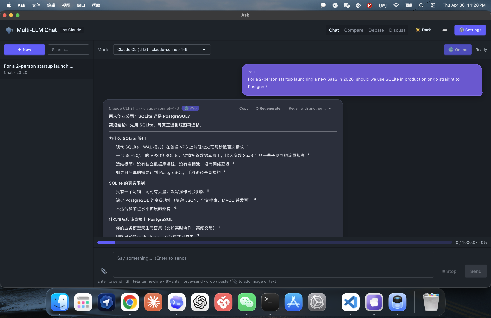
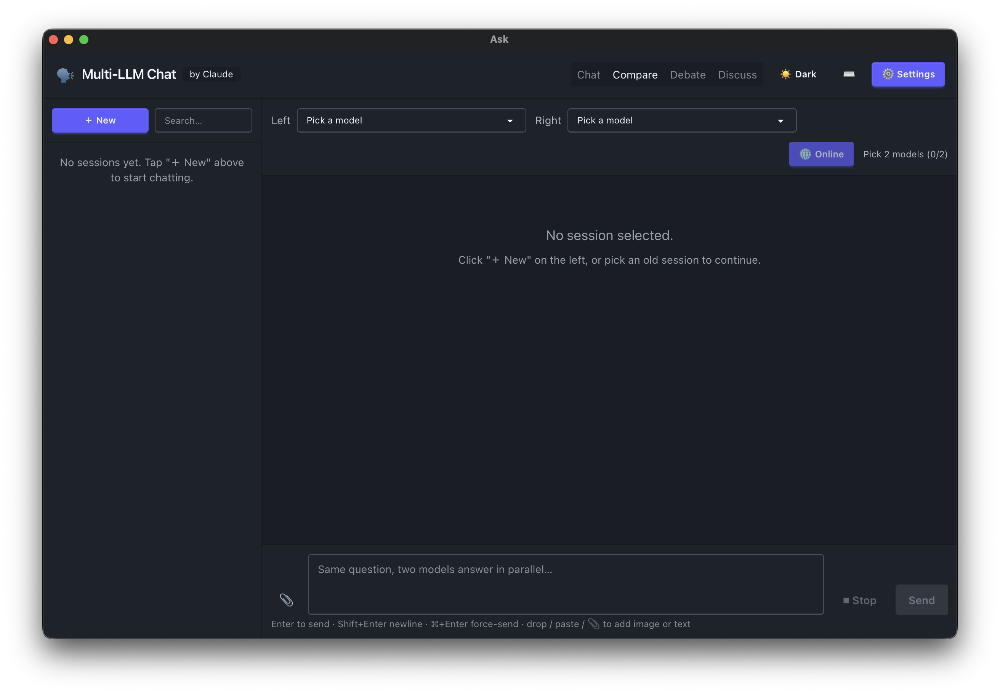
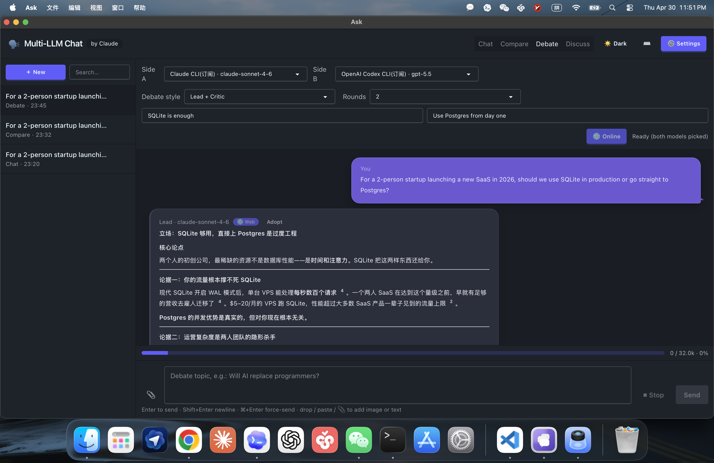
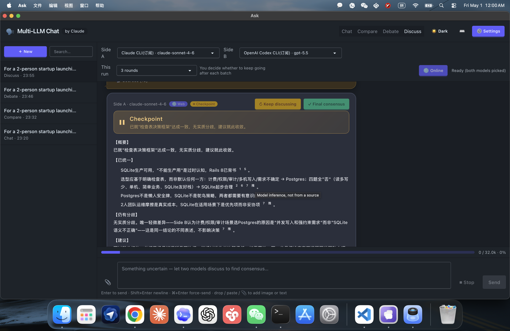
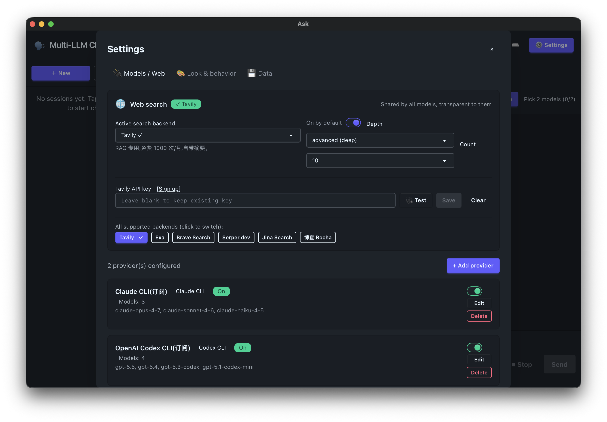

<div align="center">

# Ask

**A native macOS app for multi-LLM chat, side-by-side compare, debate, and consensus-finding — all in one window.**

*One Mac app. Every LLM. Chat with one, compare two, watch them debate, or make them reach consensus.*

[](./LICENSE)
[](https://www.apple.com/macos)
[](./CHANGELOG.md)
[](https://www.python.org/)
[](#)

**English** | [中文](./README_zh.md)

</div>

---

> Stop agonizing over "which model is best." **Summon them all in one window** — Claude, GPT, Gemini, DeepSeek, GLM, Qwen, Moonshot, your own gateway. Have them answer independently, line them up side by side, make them debate each other, or **force them to reach consensus.**

---

## 📸 A quick look

<table>
<tr>
<td width="50%" align="center">

<br/><b>Chat</b> · ⌘1 · Pick one model, chat normally
</td>
<td width="50%" align="center">

<br/><b>Compare</b> · ⌘2 · Same prompt, two models streaming side by side
</td>
</tr>
<tr>
<td width="50%" align="center">

<br/><b>Debate</b> · ⌘3 · Lead vs Critic, 1–4 rounds, pause anytime
</td>
<td width="50%" align="center">

<br/><b>Discuss</b> ✨ · ⌘4 · Protocol-driven cross-correction, auto-detect convergence
</td>
</tr>
<tr>
<td colspan="2" align="center">

<br/><b>One place to wire up every model</b> · global + China LLMs + 6 web-search backends
</td>
</tr>
</table>

---

## ✨ Why Ask

- 🪟 **A real .app**. Native menu bar, Dock badge, status item, ⌘N/W/Q shortcuts, close-without-quit — full macOS feel.
- 💬 **Four conversation modes**, one keystroke to switch:
  - **Chat** — talk to a single model, just like ChatGPT
  - **Compare** — same prompt, two models streaming side by side
  - **Debate** — Lead vs Critic, 1–4 rounds, pausable, adoptable mid-flight
  - **Discuss** ✨ new in v0.2 — both sides cross-question via protocol; **once both confidence ≥ 8 and verdicts match, it converges early**
- 🌐 **Connect anything**. Anthropic API + OpenAI API + Gemini + Claude CLI (subscription) + Codex CLI (subscription) + any OpenAI-compatible endpoint
- 🔍 **Built-in web search**, 6 backends to pick from (Tavily / Exa / Brave / Serper / Jina / Bocha) — decoupled from the LLMs
- 🔐 **API keys live in macOS Keychain**; the JSON config only stores templates and metadata
- 📦 **Local-first**. SQLite + FTS5 full-text search (CJK trigram), every conversation stays on your machine
- 🌍 **English & Chinese**, 319 strings at 100% coverage
- 🚀 **Zero front-end build**. DaisyUI v5 + Tailwind v4 + Alpine.js, all CDN — edit, refresh, done.

---

## 🚀 30-second start

```bash
git clone https://github.com/birdindasky/ask-mac.git
cd ask-mac
make build && make dmg
open dist/Ask-0.2.0.dmg
```

Drag Ask into Applications, launch via Spotlight (`Ask`) — drop in one model's API key in Settings and you're chatting.

> Don't want to build? Grab a prebuilt `.dmg` from [Releases](https://github.com/birdindasky/ask-mac/releases).

Data lives in `~/Library/Application Support/Ask/`, logs in `~/Library/Logs/Ask/ask.log`,
API keys go straight into the system keychain (service `com.birdindasky.ask`).

---

## 🛡️ First launch: getting past Gatekeeper (read this)

Ask isn't signed with an Apple Developer cert and notarized (that's a $99/year club fee 😅), so **the first double-click will be blocked by macOS** with a dialog like:

> "Ask can't be opened because Apple cannot check it for malicious software."

Don't panic — this does **not** mean Ask is malware, just that I haven't paid the Apple tax. Three ways around it (pick one, **only needed once**):

### Option A — Right-click open (fastest)

1. In Finder, locate `Ask.app` (in /Applications or wherever you dragged it)
2. **Control-click** (or right-click) Ask.app → choose **Open**
3. Click **Open** again in the popup

After that, double-click works normally.

### Option B — Allow it from System Settings

If you already double-clicked and got blocked:

1. Open **System Settings → Privacy & Security**
2. Scroll to the bottom — you'll see **"Ask was blocked because it is from an unidentified developer"**
3. Click **Open Anyway**, enter your Mac password
4. After this, double-click works fine

### Option C — Command line (for the terminal-fluent)

```bash
xattr -dr com.apple.quarantine /Applications/Ask.app
```

Strips the quarantine attribute — double-click works forever after.

> ⚠️ This applies to **every unsigned / non-Mac-App-Store Mac app**, not just Ask.

---

## 🧪 Dev / debug mode

```bash
git clone https://github.com/birdindasky/ask-mac.git
cd ask-mac
python3 -m venv venv
source venv/bin/activate
pip install -r requirements.txt
python run.py
# open http://127.0.0.1:8870 in your browser
```

In dev mode data lands in `~/.ask-dev/` and keys fall back to JSON instead of the keychain (handy for resets).

---

## 🎭 The four modes

| Mode | Shortcut | What it does |
|---|---|---|
| **Chat** | ⌘1 | Pick one model, normal multi-turn chat |
| **Compare** | ⌘2 | Pick two models, same prompt streams to both in parallel |
| **Debate** | ⌘3 | Lead + Critic (or symmetric), 1–4 rounds, pausable, adoptable |
| **Discuss** ✨ | ⌘4 | Protocol-style 6-field exchange, sides correct each other, **auto-detects consensus** |

---

## 🌐 Web search (optional)

Open ⚙️ Settings → "Web Search", pick a backend, paste the key — done.

| Backend | Sign up | Notes |
|---|---|---|
| **Tavily** | [tavily.com](https://tavily.com) | Built for RAG, returns summaries, free 1000/month |
| **Exa** | [exa.ai](https://exa.ai) | Neural search, great at digging up deep content |
| **Brave Search** | [api.search.brave.com](https://api.search.brave.com) | Independent index, free 2000/month |
| **Serper.dev** | [serper.dev](https://serper.dev) | Google results, super fast, free 2500 |
| **Jina Search** | [jina.ai/reader](https://jina.ai/reader) | Returns markdown, LLM-friendly |
| **Bocha** | [bochaai.com](https://bochaai.com) | China-based AI search, optimized for Chinese |

One backend is enough. Any of them works with every LLM provider — the flow is: **prompt → search backend → top-N hits → glued into the system context → fed to the LLM**. The model itself doesn't need to understand any search-tool protocol.

---

## 🔌 Subscription CLI mode (optional)

If you're already logged into a Claude Code or OpenAI Codex subscription in your terminal, you can run them as CLIs directly:

- In Settings, pick the **Claude CLI (subscription)** or **OpenAI Codex CLI (subscription)** template — **no API key needed**
- Ask spawns `claude` / `codex` as a subprocess with all sneaky billing-leak env vars **already scrubbed** (`ANTHROPIC_API_KEY`, `OPENAI_API_KEY`, `*_BASE_URL`, etc.)

> Prerequisite: you can already run `claude` or `codex` in your terminal and you're signed into the subscription.

---

## 🔧 Custom gateway / self-hosted OneAPI

In Settings, pick "OneAPI / NewAPI self-hosted" or "Custom OpenAI-compatible", then fill in:

- `base_url`: e.g. `http://127.0.0.1:3000/v1`
- `api_key`: the key your gateway issued
- Model list: one per line, the model IDs your gateway has enabled

---

## ⚙️ Port / data directory customization

Environment variables (active in source mode; the .app uses defaults):

| Variable | Default | Notes |
|---|---|---|
| `MLC_HOST` | `127.0.0.1` | uvicorn bind address |
| `MLC_PORT` | `8870` | port |
| `MLC_DATA_DIR` | dev `~/.ask-dev/` <br/> .app `~/Library/Application Support/Ask/` | config + database |
| `MLC_LOG_DIR` | dev `~/.ask-dev/logs/` <br/> .app `~/Library/Logs/Ask/` | log directory |
| `MLC_CLI_TIMEOUT` | `120` | per-request CLI timeout (seconds) |
| `MLC_PACKAGED` | `0` | `1` forces .app paths (testing) |
| `MLC_FORCE_KEYCHAIN` | `0` | `1` makes dev mode also use the keychain |
| `MLC_RELOAD` | `0` | `1` enables uvicorn hot reload |

---

## ✅ Run the tests

```bash
source venv/bin/activate
python -m pytest -q
```

Covers: adapter registration, env scrub, config migrations, session/message CRUD, and full SSE flows for all four modes. **42 cases.**

---

## 📁 Layout

```
mac_launcher.py       .app entry: uvicorn-in-thread + PyWebView + AppKit chrome
run.py                dev-mode entry
setup.py              py2app config
Makefile              dev / test / icon / build / dmg / install
scripts/
├── build_icon.py     generates assets/Ask.icns
└── build_dmg.py      packages dist/Ask.app into a .dmg
assets/
├── Ask.icns          app icon
└── Ask.iconset/      multi-resolution icon source (auto-generated)
app/
├── main.py           FastAPI wiring / static-file path resolution
├── settings.py       paths and constants (dev vs .app switch)
├── db.py             SQLite + FTS5 messages_fts
├── config_store.py   config.json persistence (API keys never land in JSON)
├── api/              REST + SSE routes
├── modes/            chat / compare / debate / discuss
├── providers/        per-vendor adapters + cli_detect PATH resolution
├── security/         keychain wrapper + secrets helpers
├── search/           6 web-search backends + citation injection
└── utils/            token_budget / attachments / autostart / notifier / dock_badge
static/               front end (single-page HTML + Alpine + DaisyUI + Tailwind)
tests/                42 pytest cases
```

---

## 🎁 What's new in v0.2

- **Discuss mode** — a fourth tab where two models alternate in a protocol-style 6-field format (`[Current verdict] / [Confidence] / [Support] / [Corrected by other] / [Still holding] / [Need from other]`). The backend reads `[Confidence]` numbers in real time — **both ≥ 8 + verdicts agree → converge early**; otherwise run the full N rounds (default 3, adjustable 1–5). When it ends, side A appends a summary with a `📌 Consensus` badge and a `📋 Copy consensus` button.
- **Context progress bar** — token usage estimated after each turn; near 90% you get a "Compact history" button.
- **Regenerate** — hit ↻ on the last assistant bubble to regenerate, or pick a different model from the dropdown to redo the answer with that model.
- **⌘F global search** — SQLite FTS5 search across every conversation; trigram tokenizer means Chinese hits work too.
- **Attachments** — drop images or text files into the chat box, works in all four modes.
- **Welcome wizard** — 4-screen first-launch tour that gets your first key wired up in 30 seconds.
- **i18n at 100%** — English & Chinese, 319 strings, switch in Settings.
- **Full desktop chrome** — NSMenu / NSStatusItem tray / Dock badge / system notifications / launch-at-login / About panel.
- **Close-without-quit** — closing the main window just hides it; ⌘Tab brings it back; Dock Quit / `killall` / Activity Monitor all clean-shutdown properly.

---

## 🍴 Forking notes

If you fork this for your own use, **strongly consider** changing `birdindasky` / `Ask` in the three places below to your own identifiers — otherwise two apps will fight over the same macOS Keychain entry and data directory:

- `APP_NAME` and `BUNDLE_ID` in `app/settings.py`
- `CFBundleName` / `CFBundleDisplayName` / `CFBundleIdentifier` in the plist inside `setup.py`
- `APP_NAME` (and the resulting `DMG_NAME`) in the `Makefile`

Then `make build && make dmg` produces your own standalone .app, with data in `~/Library/Application Support/<your APP_NAME>/`, fully isolated from the original author's environment.

---

## ⚠️ Known limitations

- Image attachments are currently base64-buffered and the LLM only sees an `[attached image: name]` placeholder; real vision support lands in v0.3 via Anthropic / OpenAI / Gemini multimodal APIs.
- No code signing / notarization (built for personal use, no Apple Notary). For real distribution, configure a Developer ID and edit `setup.py`.
- v0.2 has no built-in auto-update — upgrades mean re-running `make dmg`.

---

## 📋 Acceptance checklist

The hands-on acceptance checklist lives in [`ACCEPTANCE.md`](./ACCEPTANCE.md).

---

## 📜 License

[MIT](./LICENSE) © 2026 — use it, modify it, ship it commercially, redistribute it. Just don't sue me.

---

<div align="center">

**Built by [birdindasky](https://github.com/birdindasky) · Designed for vibecoders who hate switching tabs**

If this project helped you, drop a star 🌟 to make the author's day.

</div>
